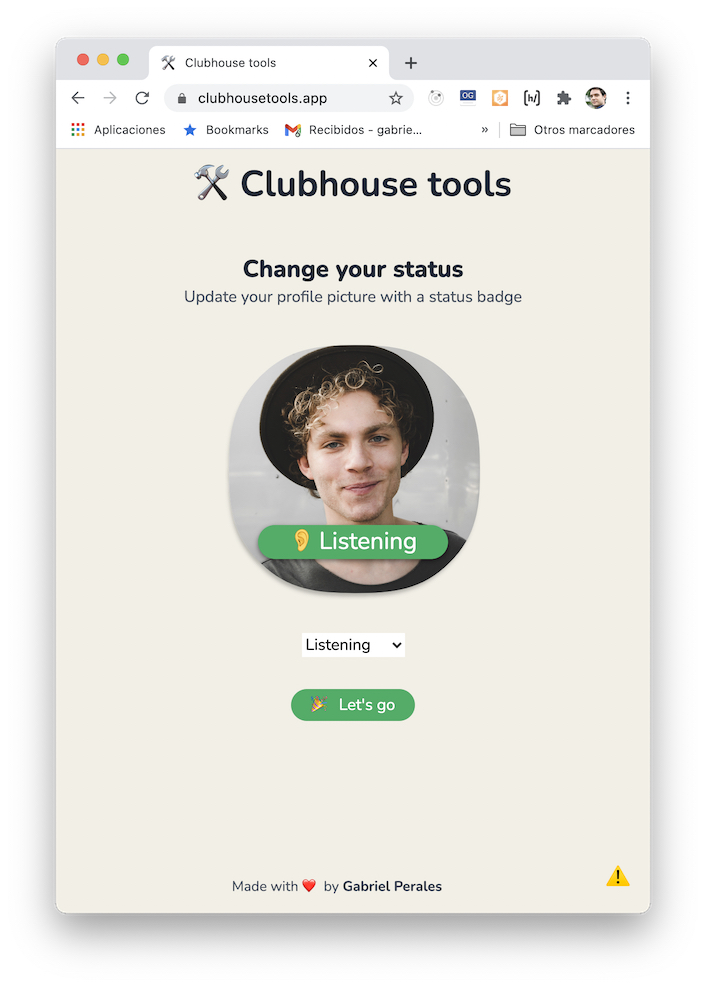

# 🛠 Clubhouse Tools



Clubhouse Tools is a small app written in React (Nextjs) with React Konva to create profile images with status. 

The idea is keep adding some other helpful tools to the app but for now I just wanted to play creating images with `canvas`.

## Getting started

You can run the app locally running:

```
npm install

npm start
```


## To-Do

- [ ] Convert the app into a PWA
- [ ] Allow users add their own status?
- [ ] Add border to the image

## License

MIT © [Gabriel Perales](https://github.com/gabrielperales)